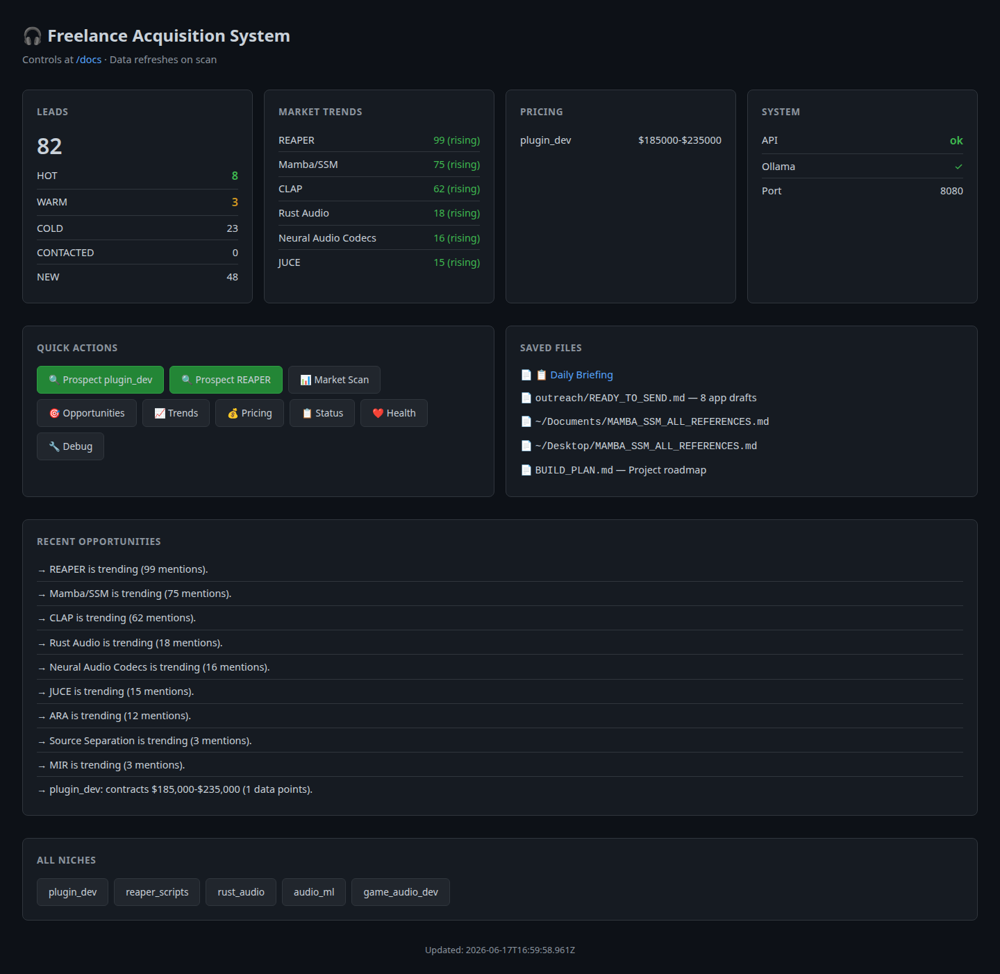
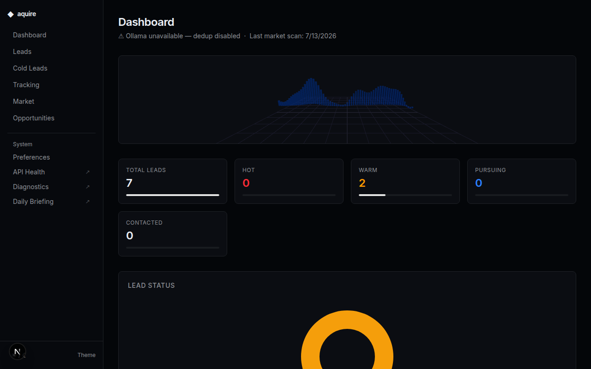
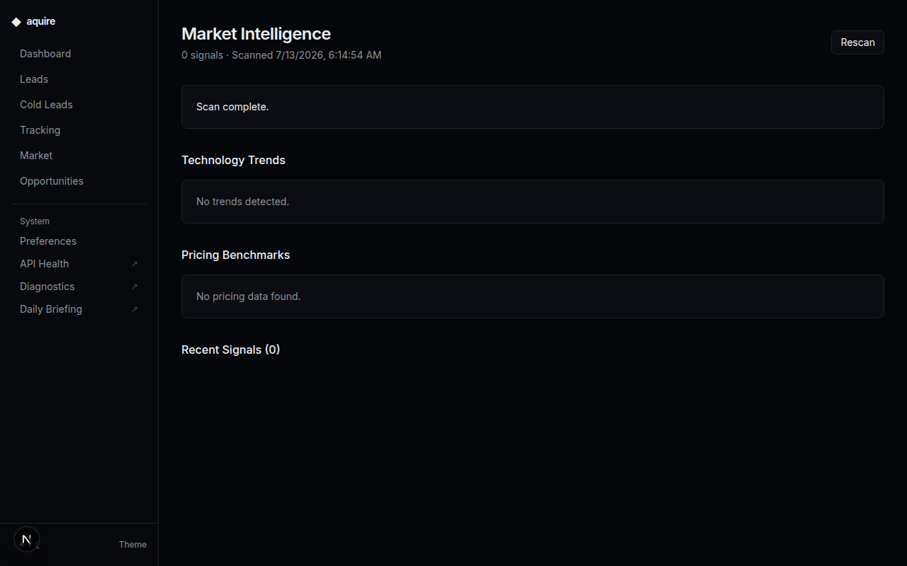
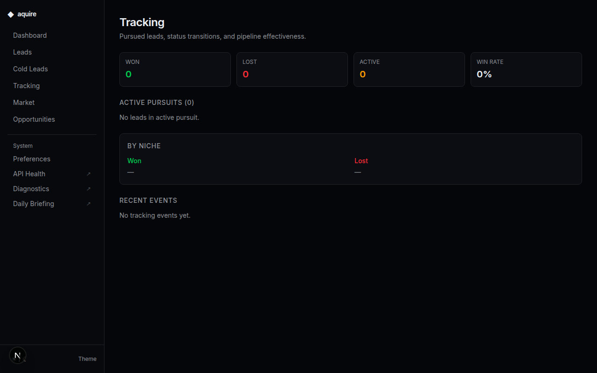
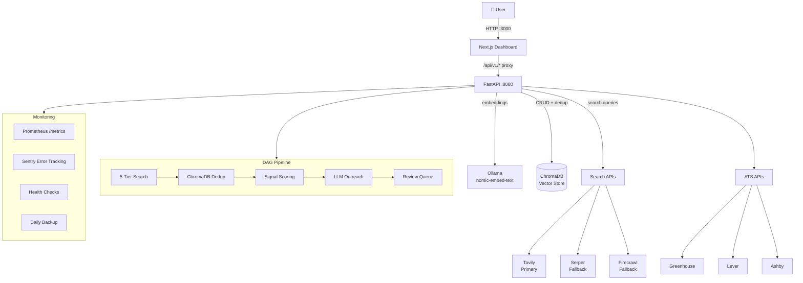

<p align="center">
  <h1 align="center">◆ Audio-Freelance</h1>
  <p align="center">Automated lead sourcing, scoring, and market intelligence<br />for freelance audio/DSP/plugin developers.</p>
</p>

<p align="center">
  <a href="#features">Features</a> ·
  <a href="#screenshots">Screenshots</a> ·
  <a href="#quick-start">Quick Start</a> ·
  <a href="#architecture">Architecture</a> ·
  <a href="#api">API</a> ·
  <a href="#market-intelligence">Market Intelligence</a> ·
  <a href="#license">License</a>
</p>

<p align="center">
  
  
  
</p>

---

<p align="center">
  
</p>

---

**Audio-Freelance** is a full-stack system that finds freelance audio development work — not by scraping job boards, but by mining market intelligence: funding rounds, technology trends, product launches, hiring signals, and pricing data. It scores leads, tracks opportunities, and generates outreach drafts.

Built for audio DSP engineers, plugin developers, and audio ML engineers who want to spend less time hunting and more time coding.

## Features

**Search & Score** — Multi-tier search across KVR Audio, JUCE Forum, Reddit, HN, GitHub, LinkedIn, and company career pages. Scored by signal detection (C++/Rust DSP, CLAP, Mamba/SSM, REAPER, on-device ML, etc.) with configurable thresholds.

**Market Intelligence** — 6-category market scanner: funding rounds, technology trends, product launches, pricing benchmarks, hiring signals, and GitHub activity. Tracks 14+ technologies (CLAP, ARA, Mamba/SSM, Rust Audio, JUCE, etc.) with rising/stable/declining status.

**Outreach Generator** — Templated outreach drafts (A-D) with asset registry claim validation. Proposal generator with pricing tiers and IP licensing notes. Ready-to-send application materials for live opportunities.

**Dashboard** — Next.js 16 dark-mode dashboard with lead management, market trends, pricing benchmarks, and one-click prospecting. Theme toggle, keyboard navigable.

## Screenshots

| Dashboard | Market Intelligence | Lead Pipeline |
|---|---|---|
|  |  |  |

### Capturing Screenshots

```bash
# 1. Start the app
./run.sh

# 2. Take screenshots (Firefox)
firefox --screenshot frontend/public/screenshots/dashboard.png http://localhost:3000/
firefox --screenshot frontend/public/screenshots/market.png http://localhost:3000/market
firefox --screenshot frontend/public/screenshots/pipeline.png http://localhost:3000/tracking

# 3. Or use Chrome headless
google-chrome --headless --screenshot=frontend/public/screenshots/dashboard.png --window-size=1280,800 http://localhost:3000/
```

## Quick Start

```bash
# Install backend + frontend dependencies
make install

# Start both servers
./run.sh
# or: make dev
```

Then open **http://localhost:3000**

### Prerequisites

- Python 3.12+
- Node.js 22+
- [Ollama](https://ollama.ai) with `nomic-embed-text` (for dedup)
- Search API keys (Tavily, Serper, or Firecrawl) — set in `.env`

```bash
cp .env.example .env
# Add your API keys
ollama pull nomic-embed-text
```

### Individual Commands

```bash
make backend    # FastAPI on :8080
make frontend   # Next.js on :3000
make test       # Run 65 backend tests
make build      # Production frontend build
```

## Architecture



### Data Flow

1. **Prospect**: User clicks "Prospect plugin_dev" → `POST /api/v1/prospect/{niche}` → Pipeline runs 5 search tiers in parallel → Dedup via ChromaDB embeddings → Score against user profile → Store HOT/WARM in ChromaDB, archive COLD/SKIP
2. **Dashboard**: `GET /api/v1/status` + `GET /api/v1/market` → Aggregated lead counts, technology trends, pricing benchmarks
3. **Outreach**: `POST /api/v1/outreach/{lead_id}` → LLM generates draft from template → Logged to outreach collection
4. **Triage**: `POST /api/v1/tracking/triage` → Keyword classifier → Suggested action (proposal/rate/archive/dead)
5. **Backup**: `scripts/backup.sh --retain 7` → Tars ChromaDB + archives + tracking + profile → Prunes old backups
6. **Metrics**: Prometheus scrapes `GET /api/v1/metrics` every 15s → Counters for pipeline runs, leads discovered, API requests

### Search Tiers

| Tier | Frequency | Sources |
|------|-----------|---------|
| Tier 1 | Daily | KVR Audio, JUCE Forum, Reddit (audio_programming, REAPER) |
| Tier 2 | Weekly | We Work Remotely, RemoteOK, Wellfound, HN Algolia |
| Tier 3 | Niche | Audio Programmer, GitHub bounties, music-tech boards |
| Tier 4 | Outbound | Plugin companies, YC audio startups, AI-audio startups |

## Environment Variables

All configuration is centralized in `config.py` (pydantic-settings). Copy `.env.example` to `.env` and fill in required values.

### Required

| Variable | Description | Example |
|---|---|---|
| `TAVILY_API_KEY` | Tavily search API key | `tvly-dev-...` |
| `SERPER_API_KEY` | Serper (Google) search API key | `abc123...` |
| `FIRECRAWL_API_KEY` | Firecrawl web scraping API key | `fc-...` |

### Optional — Authentication

| Variable | Default | Description |
|---|---|---|
| `API_KEY` | `""` (open access) | Bearer token for API auth. Leave empty for local dev. |
| `GITHUB_TOKEN` | `""` | GitHub personal access token for API queries |

### Optional — Ollama

| Variable | Default | Description |
|---|---|---|
| `OLLAMA_HOST` | `http://localhost:11434` | Ollama server URL for embeddings |

### Optional — ChromaDB

| Variable | Default | Description |
|---|---|---|
| `CHROMA_COLLECTION_LEADS` | `freelance_leads` | Collection name for lead storage |
| `CHROMA_COLLECTION_OUTREACH` | `freelance_outreach_log` | Collection name for outreach logs |
| `EMBEDDING_MODEL` | `nomic-embed-text` | Ollama model for embeddings |
| `DEDUP_SIMILARITY_THRESHOLD` | `0.92` | Cosine similarity threshold for dedup |
| `LEADS_DATA_DIR` | `""` | Override ChromaDB data directory |
| `LEADS_ARCHIVE_DIR` | `""` | Override archive directory |
| `LEADS_TRACKING_DIR` | `""` | Override tracking directory |
| `LEADS_ALLOW_TEST_LEADS` | `false` | Allow test-source leads in production |

### Optional — Search

| Variable | Default | Description |
|---|---|---|
| `PREFERRED_NICHES` | `plugin_dev,reaper_scripts,rust_audio,audio_ml,game_audio_dev` | Comma-separated niches to search |
| `MIN_RATE_CAD` | `3000` | Minimum project rate in CAD |
| `HOURLY_FLOOR_CAD` | `150` | Minimum hourly rate in CAD |

### Optional — Scoring

| Variable | Default | Description |
|---|---|---|
| `HOT_THRESHOLD` | `10` | Score threshold for HOT verdict |
| `WARM_THRESHOLD` | `5` | Score threshold for WARM verdict |

### Optional — Operations

| Variable | Default | Description |
|---|---|---|
| `COLD_ROTATION_DAYS` | `3` | Days before COLD leads are auto-rotated |
| `LOG_LEVEL` | `INFO` | Logging level (DEBUG, INFO, WARNING, ERROR) |
| `HOST` | `127.0.0.1` | Server bind address |
| `PORT` | `8080` | Server port |
| `CORS_ORIGINS` | `""` | Comma-separated additional CORS origins |
| `PROFILE_PATH` | `""` | Override profile file path |
| `COMPANIES_PATH` | `""` | Override companies data path |

### Optional — Observability

| Variable | Default | Description |
|---|---|---|
| `SENTRY_DSN` | `""` | Sentry DSN for error tracking (disabled if empty) |
| `ENVIRONMENT` | `development` | Deployment environment (development/production) |

## Production Readiness

### What's Production-Grade

| Capability | Status |
|---|---|
| Centralized config (pydantic-settings) | ✅ |
| Structured JSON logging (structlog) | ✅ |
| Request correlation IDs | ✅ |
| Error tracking (Sentry, optional) | ✅ |
| Prometheus metrics | ✅ |
| API rate limiting (60 req/min) | ✅ |
| Bearer token auth | ✅ |
| CORS + security headers | ✅ |
| Automated backups (retention: 7) | ✅ |
| Data integrity checks | ✅ |
| Docker images (GHCR) | ✅ |
| Docker Compose (dev + prod profiles) | ✅ |
| CI pipeline (lint + test + build + docker) | ✅ |
| 81 unit tests | ✅ |
| Input validation (Pydantic) | ✅ |
| API documentation (OpenAPI at /docs) | ✅ |

### Not Yet Implemented

| Gap | Why Not |
|---|---|
| Frontend tests | Legacy — frontend is Next.js without test framework |
| E2E tests | Requires running full stack with external APIs |
| One-click cloud deploy | ✅ Fly.io `fly.toml` + CD workflow (needs Fly account + `FLY_API_TOKEN` secret) |
| Multi-user / RBAC | Solo tool — not a SaaS product |
| HTTPS in dev | Expected at reverse proxy level (nginx/Caddy) |

## API

| Method | Path | Description |
|--------|------|-------------|
| `GET` | `/api/v1/health` | Health check |
| `GET` | `/api/v1/status` | Lead counts + system status |
| `GET` | `/api/v1/leads` | List leads (filterable by status) |
| `POST` | `/api/v1/prospect/{niche}` | Search → dedup → score pipeline |
| `POST` | `/api/v1/score` | Manually score a raw candidate |
| `POST` | `/api/v1/translate` | Tech capability → client pitch |
| `POST` | `/api/v1/outreach/{lead_id}` | Generate outreach draft |
| `POST` | `/api/v1/proposal` | Generate structured proposal |
| `POST` | `/api/v1/rate` | Rate tiers for a task |
| `GET` | `/api/v1/market` | Full market intelligence report |
| `GET` | `/api/v1/market/trends` | Technology trends |
| `GET` | `/api/v1/market/pricing` | Pricing benchmarks |
| `GET` | `/api/v1/market/opportunities` | Actionable opportunities |
| `POST` | `/api/v1/debug` | Run diagnostics |
| `GET` | `/briefing` | Plain-text daily briefing |
| `POST` | `/dispatch` | Email briefing to configured address |

## Market Intelligence

The `research/market.py` engine searches 6 signal categories in parallel:

| Category | What it finds |
|----------|--------------|
| **Funding** | Companies that raised money (hiring soon) |
| **Tech Trends** | CLAP, Mamba/SSM, Rust Audio, ARA adoption |
| **Product Launches** | New plugins, DAW features, AI music tools |
| **Pricing** | Rate data from job posts and freelance platforms |
| **Hiring Signals** | Companies actively building audio teams |
| **GitHub Trending** | What's being built in audio open source |

### Tracked Technologies

CLAP, ARA 2, Mamba/SSM, Rust Audio, ONNX, LibTorch, REAPER, Web Audio, Neural Audio Codecs, Source Separation, FAUST, JUCE, RTNeural, MIR.

## Deployment

### One-Click (Fly.io)

```bash
# 1. Install Fly CLI
curl -L https://fly.io/install.sh | sh

# 2. Create app (first time only)
fly apps create audio-freelance

# 3. Set secrets
fly secrets set TAVILY_API_KEY=your-key
fly secrets set SERPER_API_KEY=your-key
fly secrets set FIRECRAWL_API_KEY=your-key
fly secrets set API_KEY=your-auth-key  # optional

# 4. Deploy
fly deploy

# Open dashboard
fly open
```

The app includes a `fly.toml` with sensible defaults (Seattle region, 1GB RAM, auto-stop on idle).

### GitHub Actions CD

Pushing a version tag (`v0.1.3`, `v1.0.0`) triggers automatic deployment via GitHub Actions. Requires `FLY_API_TOKEN` secret in repo settings.

```bash
# Generate token
fly tokens create deploy -x 999999h

# Add to GitHub repo secrets
gh secret set FLY_API_TOKEN --body "your-fly-token"

# Deploy by pushing a tag
git tag v0.1.3 && git push origin v0.1.3
```

### Docker Compose (Self-Hosted)

```bash
# Clone and configure
cp .env.example .env
# Fill in API keys in .env

# Start full stack (dev)
docker compose up -d

# Start full stack (production overrides)
docker compose -f docker-compose.yml -f docker-compose.prod.yml up -d

# View logs
docker compose logs -f backend
```

## License

MIT — see [LICENSE](LICENSE).

---

<p align="center">
  Built by <a href="https://github.com/scottmills306">@scottmills306</a>
</p>
