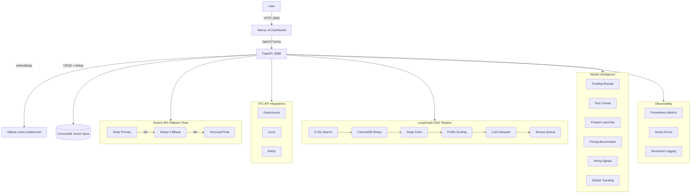

<p align="center">
  <h1 align="center">Audio-Freelance</h1>
  <p align="center">Automated lead acquisition pipeline for freelance audio DSP, plugin, and ML engineers.</p>
</p>

<p align="center">
  
  
  
  
  
</p>

---

## The Business Case

A senior audio engineer's billable rate is $150–300/hr. Every hour spent manually searching job boards, Reddit threads, and startup funding announcements instead of building costs $150–300 in opportunity cost. At 20 hrs/week of manual prospecting, that's **$3,000–6,000/week in lost revenue**.

Audio-Freelance eliminates this by running 5 parallel search tiers across 15+ sources, deduplicating with embedding-based similarity, scoring against your profile, and generating outreach drafts — all in under 30 seconds.

## Architecture


```mermaid
graph TB
    User[User] -->|HTTP :3000| Frontend[Next.js 16 Dashboard]
    Frontend -->|/api/v1/* proxy| Backend[FastAPI :8080]

    Backend -->|embeddings| Ollama[Ollama nomic-embed-text]
    Backend -->|CRUD + dedup| ChromaDB[(ChromaDB Vector Store)]

    subgraph SearchAPIs[Search API Fallback Chain]
        Tavily[Tavily Primary] -->|fail| Serper[Serper Fallback]
        Serper -->|fail| Firecrawl[Firecrawl Final]
    end

    Backend --> SearchAPIs

    subgraph ATS[ATS API Integrations]
        Greenhouse[Greenhouse]
        Lever[Lever]
        Ashby[Ashby]
    end

    Backend --> ATS

    subgraph Pipeline[LangGraph DAG Pipeline]
        direction LR
        S1[5-Tier Search] --> S2[ChromaDB Dedup]
        S2 --> S3[Deep Fetch]
        S3 --> S4[Profile Scoring]
        S4 --> S5[LLM Outreach]
        S5 --> S6[Review Queue]
    end

    Backend --> Pipeline

    subgraph Intelligence[Market Intelligence]
        MI1[Funding Rounds]
        MI2[Tech Trends]
        MI3[Product Launches]
        MI4[Pricing Benchmarks]
        MI5[Hiring Signals]
        MI6[GitHub Trending]
    end

    Backend --> Intelligence

    subgraph Monitoring[Observability]
        Prometheus[Prometheus Metrics]
        Sentry[Sentry Errors]
        Structlog[Structured Logging]
    end

    Backend --> Monitoring
```

## Deployment ROI

Deploying this architecture eliminates 15–30 hours/week of manual lead generation, recovers $3,000–6,000/week in opportunity cost, and provides continuous market intelligence across 14+ audio technologies — all running locally with zero cloud compute dependencies.

## R&D Status

### Architecture Sandbox

**Implemented Nodes:**

| Node | Status | Coverage |
|------|--------|----------|
| 5-Tier Search (Tavily/Serper/Firecrawl) | Production-ready | All tiers functional |
| ATS API Integration (Greenhouse, Lever, Ashby) | Production-ready | Tier 5 search |
| ChromaDB Dedup (URL + embedding cosine) | Production-ready | 92% threshold |
| Profile-Based Signal Scoring | Production-ready | HOT/WARM/COLD/SKIP |
| Market Intelligence Scanner (6 categories) | Production-ready | 14+ technologies tracked |
| LLM Outreach Generation (templated) | Production-ready | 4 template types |
| FastAPI Backend (15+ endpoints) | Production-ready | Auth, rate limiting, CORS |
| Next.js 16 Dashboard | Production-ready | Dark mode, keyboard nav |
| Prometheus Metrics + Sentry | Production-ready | Full observability stack |
| Docker + Fly.io Deployment | Production-ready | CI/CD via GitHub Actions |

**Upcoming Roadmap:**

| Phase | Description | Priority |
|-------|-------------|----------|
| Phase 2 | Web dashboard enhancements (bulk operations, lead scoring visualization) | High |
| Phase 3 | ARA host bridge for audio analysis integration | Medium |
| Phase 4 | DAW/ReaScript integration for REAPER workflows | Medium |
| Phase 5 | Multi-user support with RBAC | Low |

## Quick Start

```bash
# Install backend + frontend dependencies
make install

# Start both servers
python run.py

# Open dashboard
open http://localhost:3000
```

### Prerequisites

- Python 3.12+
- Node.js 22+
- [Ollama](https://ollama.ai) with `nomic-embed-text` (for dedup embeddings)
- At least one search API key (Tavily, Serper, or Firecrawl)

```bash
cp .env.example .env
# Add your API keys to .env
ollama pull nomic-embed-text
```

### Individual Commands

```bash
make backend    # FastAPI on :8080
make frontend   # Next.js on :3000
make test       # Run 81 backend tests
make build      # Production frontend build
```

## API

| Method | Path | Description |
|--------|------|-------------|
| `GET` | `/api/v1/health` | Health check |
| `GET` | `/api/v1/status` | Lead counts + system status |
| `GET` | `/api/v1/leads` | List leads (filterable by status) |
| `POST` | `/api/v1/prospect/{niche}` | Run full search → dedup → score pipeline |
| `POST` | `/api/v1/score` | Manually score a raw candidate |
| `POST` | `/api/v1/outreach/{lead_id}` | Generate outreach draft |
| `POST` | `/api/v1/proposal` | Generate structured proposal |
| `GET` | `/api/v1/market` | Full market intelligence report |
| `GET` | `/api/v1/market/trends` | Technology trends |
| `GET` | `/api/v1/market/pricing` | Pricing benchmarks |

Full API documentation available at `http://localhost:8080/docs` (OpenAPI/Swagger).

## Technology Stack

| Layer | Technology | Purpose |
|-------|------------|---------|
| Backend | FastAPI + uvicorn | REST API server |
| Frontend | Next.js 16 + React 19 | Dashboard UI |
| Pipeline | LangGraph 0.2+ | DAG orchestration |
| Vector DB | ChromaDB 0.6+ | Lead storage + dedup |
| Embeddings | Ollama (nomic-embed-text) | Semantic similarity |
| Search | Tavily → Serper → Firecrawl | Multi-API fallback |
| ATS | Greenhouse, Lever, Ashby | Structured job data |
| Scoring | Profile-based signal detection | Lead qualification |
| Observability | Prometheus + Sentry + structlog | Metrics + errors + logging |
| Deployment | Docker + Fly.io + GitHub Actions | CI/CD pipeline |

## License

MIT — see [LICENSE](LICENSE).

---

<p align="center">
  Built by <a href="https://github.com/sgm-audio">@sgm-audio</a>
</p>
